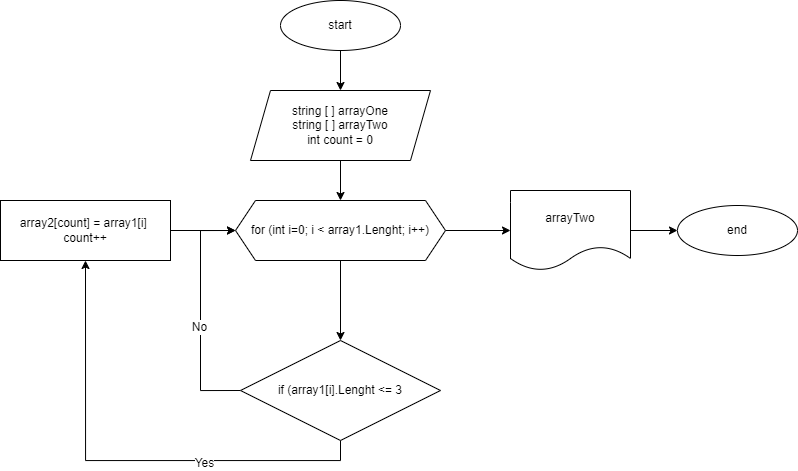

# Итоговая контрольная работа

## Описание задачи:
Написать программу, которая из имеющегося массива строк формирует новый массив из строк, длина которых меньше, либо равна 3 символам. Первоначальный массив можно ввести с клавиатуры, либо задать на старте выполнения алгоритма.

*При решении не рекомендуется пользоваться коллекциями, лучше обойтись исключительно массивами.*

## Алгоритм решения задачи ##
1. Объявляем исходный заполненный массив.  
2. Объявляем второй соразмерный массив.
3. Перебираем значения исходного массива.
4. Проверяем каждое значение массива по очереди на соответствие условию: длинна строки меньше или равно "3".
5. Если условие выполняется, то данное значение из исходного массива кладем во второй массив.
6. Повторяем пункты 4 и 5 до тех пор пока не достигнем конца исходного массива.
7. Выводим второй заполненный массив.

## Блок-схема алгоритма: ##

## Программа: ##
Программа расположена в папке "endBlockTask", файл "Program.cs".